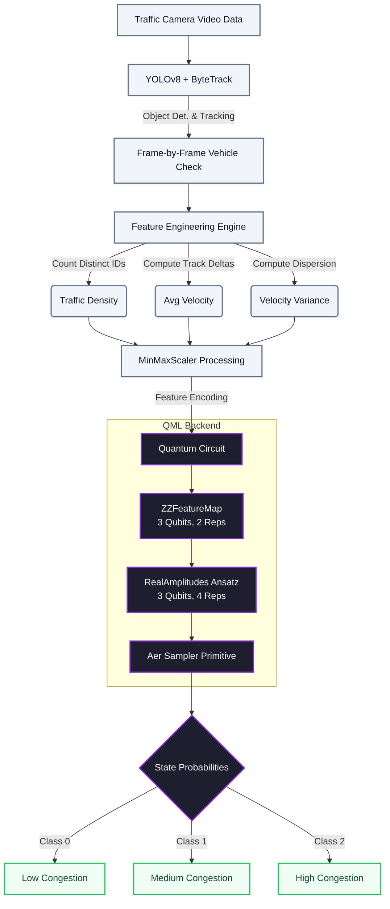

# Quantum-Enhanced Traffic Congestion Prediction 🚦⚛️

A cutting-edge intelligent traffic analysis pipeline that integrates classical Computer Vision (YOLOv8 object tracking) for feature extraction with a Quantum Machine Learning (QML) Neural Network to accurately predict intersection congestion states.

## 🌟 The Architecture

This system leverages a hybrid Classical-Quantum pipeline to extract dense physical mechanics from traffic intersections and map them into multidimensional Hilbert space for robust state classification.

### System Flow

### 1. Classical Vision Node (Offloaded)
We process real-world intersection videos utilizing `ultralytics` **YOLOv8n** to robustly detect and track active instances of vehicles (Cars, Motorcycles, Buses, and Trucks). Using bounding box coordinate differentials over strict frame-rate timings, we compute the following core metrics per video-window:
- **Active Vehicles (Density)**: The total unique objects localized.
- **Average Velocity**: The combined pixel/second trajectory speed vectors.
- **Velocity Variance**: Evaluates how consistently traffic is moving or stopping.

### 2. The Quantum Neural Network
Once features are compiled and scaled, they are funneled into a **Qiskit `SamplerQNN`**. 
- The data is embedded using a robust non-linear **`ZZFeatureMap`** to translate the classical metrics into a higher-dimensional quantum state. 
- A **`RealAmplitudes`** parameterized ansatz serves as the tunable weights of our neural network, consisting of entangling gates.
- We then execute the parameterized circuit and sample the probable measurements (`AerSampler`) to map to our 3 final congestion classes.

## 🚀 Live Web Interface

We ship a complete **FastAPI** + **Vanilla HTML/CSS/JS** production app that encapsulates our trained QML model.

1. Navigate to the `backend/` folder.
2. Install dependencies: `pip install -r requirements.txt` (or if none, install `fastapi uvicorn qiskit qiskit_machine_learning pandas`)
3. Run the backend: `python main.py`
4. Open **http://localhost:8000** to utilize the manual data-entry interface and evaluate custom intersection densities directly off the Quantum Sampler!

## 📂 Repository Contents
- **`QML/qml.ipynb`**: Complete training pipeline and Jupyter implementation of the Quantum Network.
- **`YOLO/tracking.ipynb`**: Original vision extraction notebooks used to formulate our datasets.
- **`backend/`**: Contains the decoupled production environment logic.
- **`qml_trained_weights.npy`**: The frozen target parameters iteratively learned by our `COBYLA` optimizer.
- **`scaler.pkl`**: Standard MinMax scales to constrain numerical extremes prior to phase encoding.
